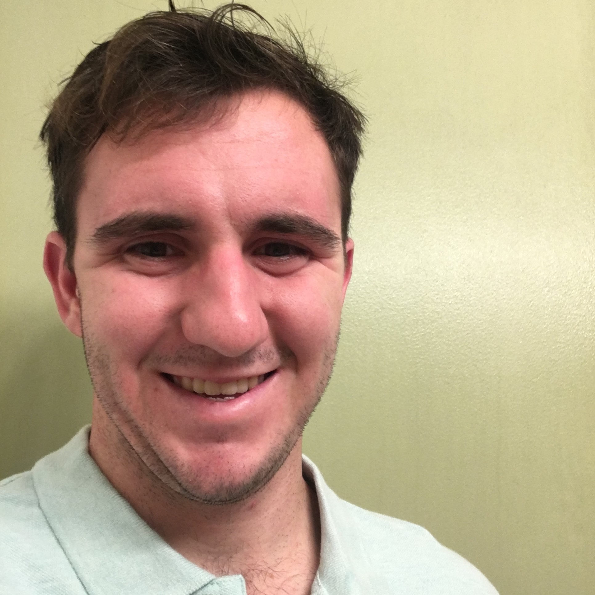

{:.avatar}

#Andrew Dudley
Computer Science Student

<a href="mailto:">dudley.ak@gmail.com</a>
|
<i class="fa fa-github"></i> <a href="http://github.com/adudleyssf">my account</a>
|

## Currently

 I am finishing up my highschool degree at cornoado highschool and atteneding the softstackfactory coding camp, Also I am practicing with a water polo club team right now.

## Education
`2012-2016`
__Coronado High school__   High school degree

## Technical skills

* HTML and CSS
* Javascript
* node.js
* mongodb
* angular.js
* ionic

## Projects

### ride_sharing

I made this app as an app to help organize rides to and from events.  Users of the app could login and either join a new "team" or make their own "team"
Users could then post an event and anyone on their team could see when and where that event is members of that team could then say post if they were giving rides 
with how many seats they had available in their car and users who needed a ride could click a button on the made ride registering them with that ride and 
taking on of the available seats.

## Achievements

"For the love of the game" memorial award for water polo my senior year.  I got this award for not being the best player but for always trying my hardest in the pool.

## Hobbies

* Swimming 

## Links

* <i class="fa fa-envelope"></i> <a href="mailto:">dudley.ak@gmail.com</a> 
* <i class="fa fa-github"></i> <a href="http://github.com/adudleyssf">my account</a> 

